<a id="top"></a>
<div align="center">

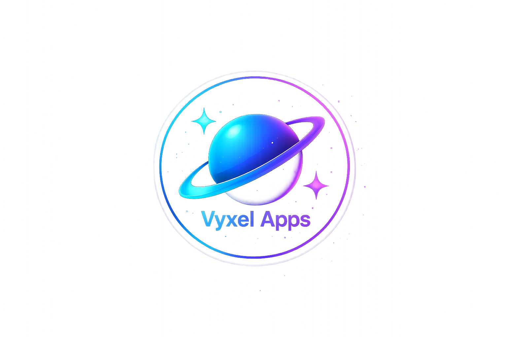

# OMNI APPS


[](LICENSE)
[](https://github.com/smartworldarafath/Omni-Apps/releases)
[](https://github.com/smartworldarafath/Omni-Apps/stargazers)
[](https://kotlinlang.org)
[](#)

[**⬇ Download APK**](https://github.com/smartworldarafath/Omni-Apps/releases/latest) &nbsp;·&nbsp; [**🌐 Website**](https://smartworldarafath.github.io/Omni-Apps/) &nbsp;·&nbsp; [**🐛 Report Bug**](https://github.com/smartworldarafath/Omni-Apps/issues)

<br/>

[](#features)
[](#screenshots)
[](#installation)
[](#tech-stack)

</div>

---

> ⚠️ **Official Source Notice**
> The ONLY official source for Omni Apps is this repository.
> APKs from any other website, Telegram channel, or source are
> unofficial and may be tampered with. Always verify the signature.

<a id="features"></a>
## ✨ Features

<table>
<tr>
<td width="50%" valign="top">

**🔍 6 sources, one store**
GitHub, GitLab, F-Droid, IzzyOnDroid, APKPure, and Aptoide — scanned and merged into a single feed.

**🗂 17 curated categories**
Games, Productivity, Security, Dev Tools, Media, Finance and more, plus smart sections like Trending and Newly Launched.

**🛡 Signature verification**
Every downloaded APK is checked against the installed app's signing certificate before install — a hijacked repo or redirected release can't silently overwrite what's on your phone.

**🥷 Silent installs via Shizuku**
Skip the system install confirmation screen entirely when Shizuku is running.

**🛡 Trust Score system**
0–100 score based on stars, activity, releases, and forks.

**🔔 Background update monitoring**
WorkManager checks installed apps against all six sources and notifies you of updates.

</td>
<td width="50%" valign="top">

**📱 Home screen widget**
App of the Day plus your pending update count, refreshed every 30 minutes.

**⚖️ App comparison mode**
Compare two apps side-by-side.

**📸 Auto-extracted screenshots**
Pulled straight from each repo's README.

**🔄 Install history & rollback**
Roll back to a previous version straight from your install history.

**⭐ GitHub starred repos sync**
Sync your stars into favourites.

**🌍 16 languages**
English, Hindi, Spanish, French, German, Japanese, Portuguese, Italian, Russian, Chinese, Korean, Arabic, Dutch, Turkish, Polish, Swedish.

**📢 In-app announcements**
Dismissible banners for giveaways, releases, and community updates.

</td>
</tr>
</table>

<a id="screenshots"></a>
## 📱 Screenshots

<div align="center">

 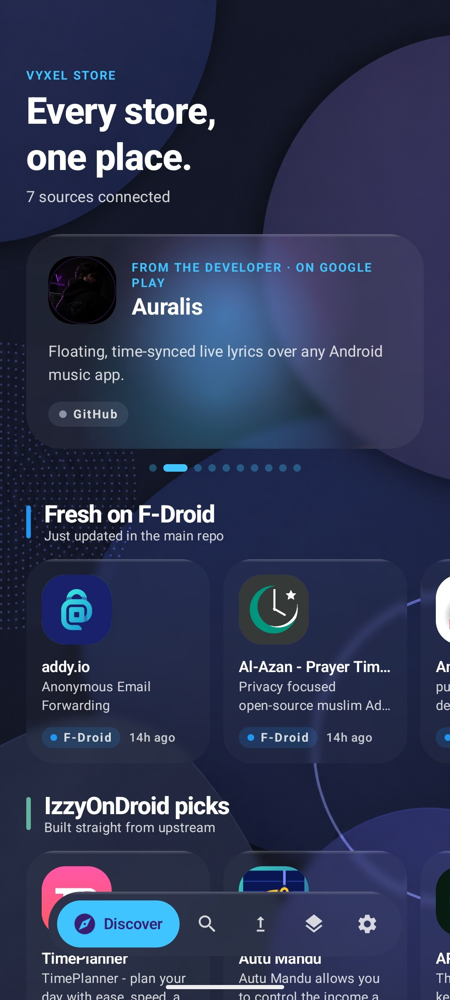  

*Home ·*

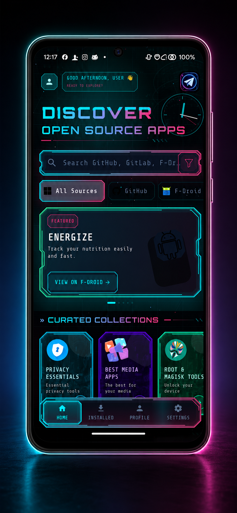 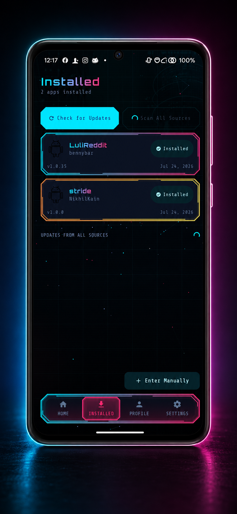 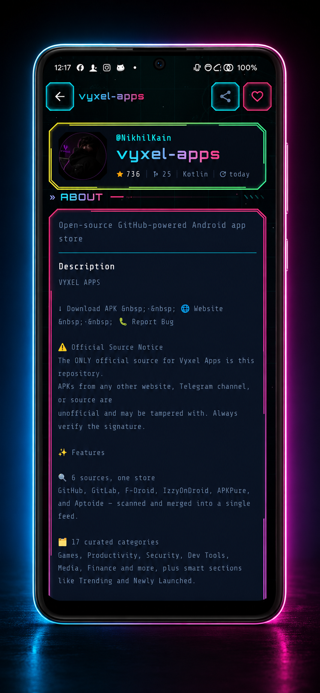 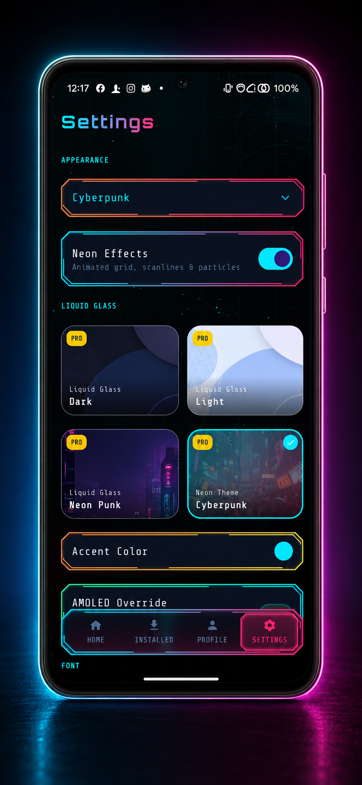

*Home · Apps · Profile · Settings*

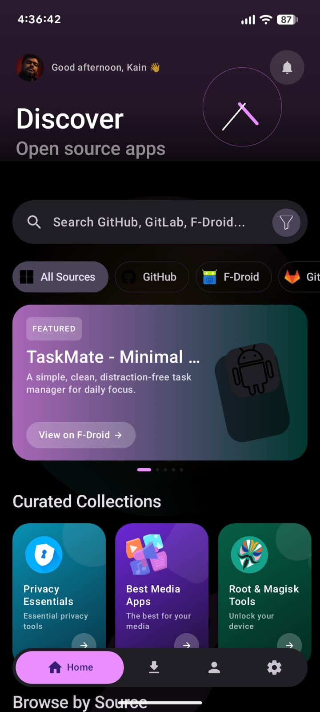 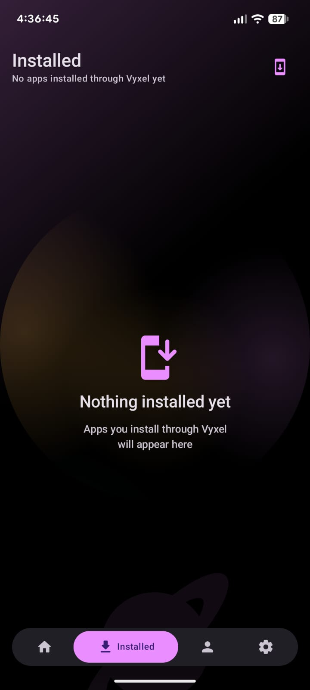 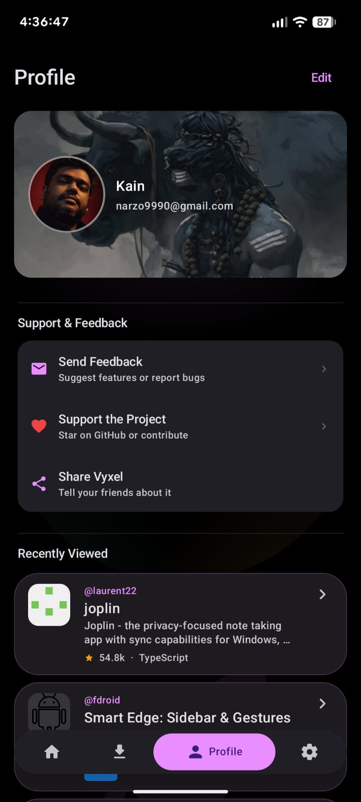 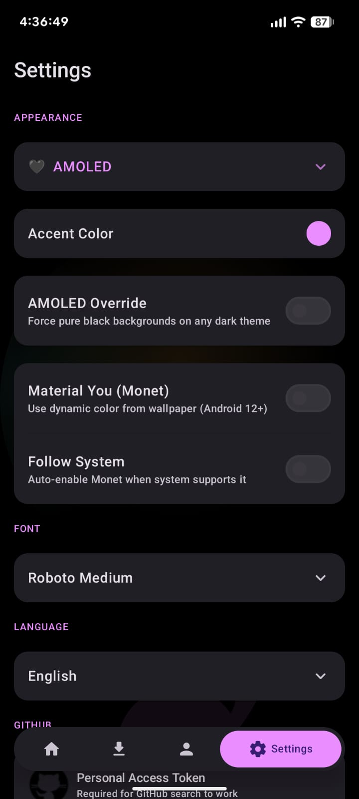

*Home · Apps · Profile · Settings*

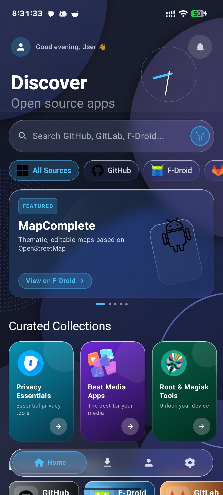 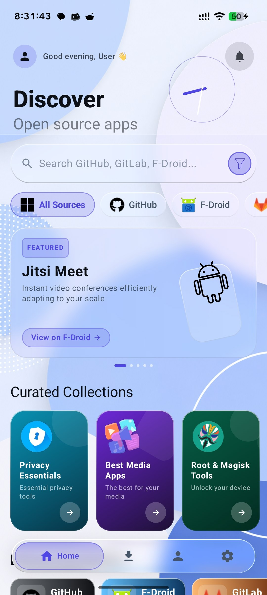 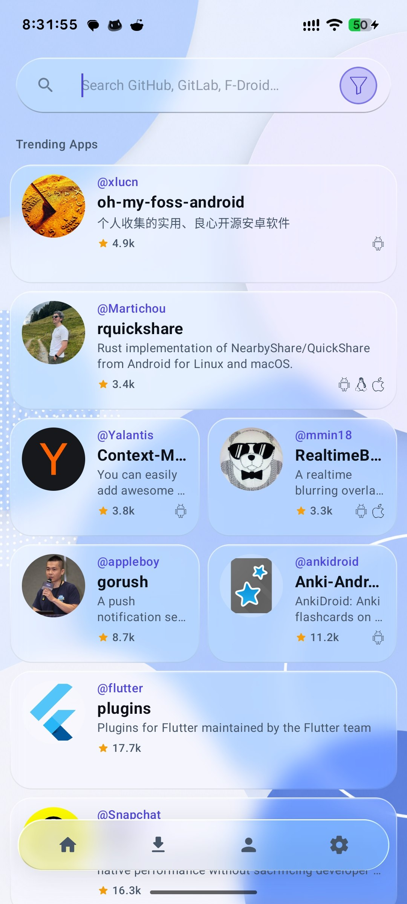 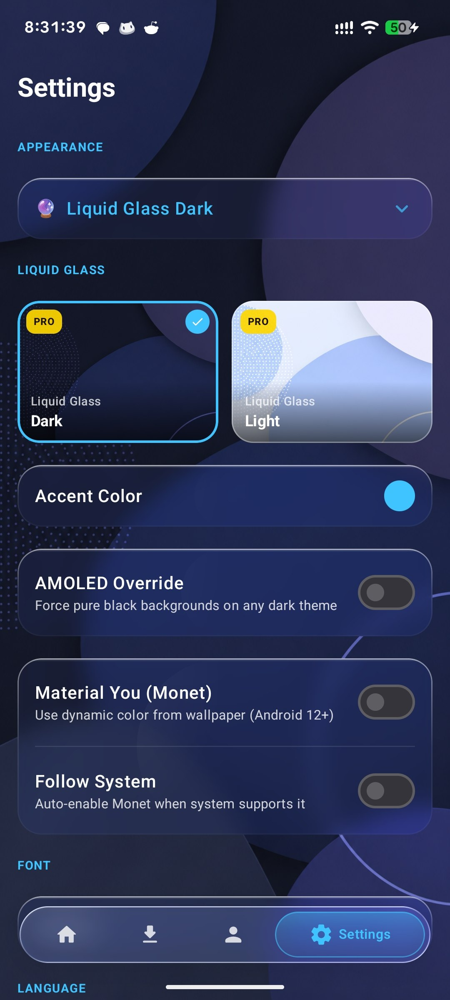

</div>

<a id="installation"></a>
## 📥 Installation

1. Download the latest APK from [Releases](https://github.com/smartworldarafath/Omni-Apps/releases/latest)
2. On your Android device: **Settings → Apps → Special access → Install unknown apps** → enable for your browser/file manager
3. Tap the downloaded APK to install

> 💡 Optional: install [Shizuku](https://shizuku.rikka.app/) for silent, confirmation-free installs of every app you update through Omni Apps.

<details>
<summary><b>🔧 Building from Source</b></summary>
<br/>

```bash
git clone https://github.com/smartworldarafath/Omni-Apps.git
cd Omni-Apps
```

Open the project in Android Studio (JDK 17, compileSdk 37, targetSdk 36, minSdk 26). It will build and run out of the box — the following `local.properties` keys are all **optional** and only needed to reproduce specific production behavior:

| Key | Purpose | If omitted |
|---|---|---|
| `signing.storeFile` / `storePassword` / `keyAlias` / `keyPassword` | Release signing | Unsigned release APK |
| `gumroad.product.id` | Liquid Glass Pro license verification | Verification disabled — Pro themes stay locked |
| `lg.hmac.secret` / `lg.script.url` | Liquid Glass license signing endpoint | N/A in forks |

Everything else — the six-source scanner, Trust Score, comparison mode, widget, and free themes — works fully without any secrets configured.

</details>

<a id="tech-stack"></a>
## 🛠 Tech Stack

<div align="center">


</div>

- [Kotlin](https://kotlinlang.org/) + [Jetpack Compose](https://developer.android.com/jetpack/compose) + [Material 3](https://m3.material.io/)
- [Retrofit](https://square.github.io/retrofit/) + [OkHttp](https://square.github.io/okhttp/) — GitHub / GitLab / F-Droid / IzzyOnDroid / APKPure / Aptoide clients
- [Coil](https://coil-kt.github.io/coil/) — image loading
- [WorkManager](https://developer.android.com/topic/libraries/architecture/workmanager) — background update checks
- [Shizuku](https://shizuku.rikka.app/) — silent installs without root
- [AndroidX Security Crypto](https://developer.android.com/jetpack/androidx/releases/security) — encrypted storage for tokens and license keys
- [Backdrop](https://github.com/Kyant0/Backdrop) — real-time blur for the Liquid Glass Pro themes

<a id="contributing"></a>


---

## ☕ Support / Buy Me a Coffee & Become a Sponsor

If you find **Omni Apps** helpful and want to support ongoing development, maintenance, and new features, consider contributing through any of the options below! Your support means the world and helps keep this project open-source.

<div align="center">

<table>
  <tr>
    <td align="center" width="25%" valign="top">
      <h4>☕ SupportKori</h4>
      <a href="https://www.supportkori.com/arafathrahman" target="_blank">
        
      </a><br/><br/>
      <a href="https://www.supportkori.com/arafathrahman" target="_blank">
        
      </a><br/>
      <sub>Cards / bKash / Nagad / Global</sub>
    </td>
    <td align="center" width="25%" valign="top">
      <h4>⚡ nsave</h4>
      <br/><br/>
      <br/>
      <sub>Ntag: <code>@arafath_rahman9</code></sub>
    </td>
    <td align="center" width="25%" valign="top">
      <h4>🔴 RedotPay</h4>
      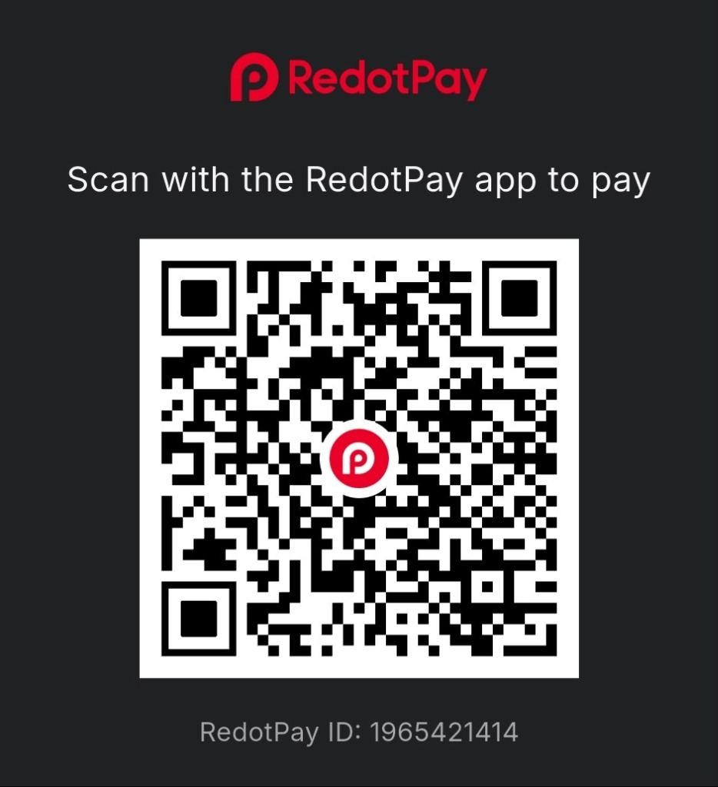<br/><br/>
      <br/>
      <sub>ID: <code>1965421414</code></sub>
    </td>
    <td align="center" width="25%" valign="top">
      <h4>🅿️ Payoneer</h4>
      <br/><br/>
      <a href="mailto:arafathrahman710@gmail.com?subject=Support%20via%20Payoneer">
        
      </a><br/>
      <sub>Email: <code>arafathrahman710@gmail.com</code></sub>
    </td>
  </tr>
</table>

<br/>

| Method | Details / Direct Link |
| :--- | :--- |
| **☕ SupportKori** | [https://www.supportkori.com/arafathrahman](https://www.supportkori.com/arafathrahman) |
| **⚡ nsave** | Ntag: `@arafath_rahman9` • `Md Arafath Rahman` |
| **🔴 RedotPay** | Account ID: `1965421414` |
| **🅿️ Payoneer** | Email: `arafathrahman710@gmail.com` • Customer ID: `70366820` |

</div>

## 🤝 Contributing

Contributions are welcome! Open an issue first to discuss what you'd like to change.

1. Fork the repo
2. Create a feature branch (`git checkout -b feature/cool-thing`)
3. Commit your changes (`git commit -m 'Add cool thing'`)
4. Push to the branch (`git push origin feature/cool-thing`)
5. Open a Pull Request

## 📄 License

[](LICENSE)

<br/>

<div align="center">


[⬆ Back to top](#top)

</div>
